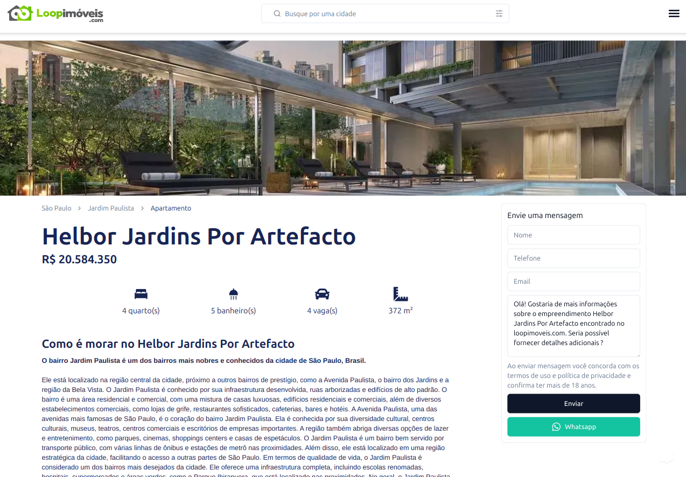

LoopImoveis is a digital marketplace for properties in the capital of São Paulo. It is one of the products from AoCubo, where, from day one, our primary goal has been to create a website focused on being as fast as possible and optimized for SEO.

## Why was this product created?

This product was created with the possibility of increasing the number of leads generated daily. The development team applies the learnings from previous projects about SEO, tests hypotheses, and validates them.

## What did I do in this project?

In this project, I worked on developing both the frontend and backend, engaging in discussions with the team about implementations, and conducting code reviews. I also created the CI/CD pipelines and implemented the search filter with a focus on speed and performance using our current resources.

## What are the results?

As a result, we generated the first lead in record time (less than two weeks) for the company after the initial release of this product, which was completed in under six days.

### What technologies were used in the frontend of this project?

The frontend uses: Git, ReactJS, React Hooks, NextJS, TypeScript, Node, React Query, NextAuth, Tailwind, Shadcn, and Axios.

### What technologies were used in the backend of this project?

The backend uses: Git, TypeScript, Node.js, NestJS, TypeORM, PostgreSQL, Jest, Docker, Heroku.

### How is this project deployed?

Both the frontend and backend are deployed using CI/CD with GitHub Actions. Both projects are deployed on Heroku.

### What were the challenges in this project?

For me, the biggest challenge was improving SEO results, especially for high-value properties. Competing against other big players is tough, but for some other properties, the results have been exceptionally good. The whole team is constantly researching and learning about SEO and accessibility to improve this product's performance and increase the company's revenue.
