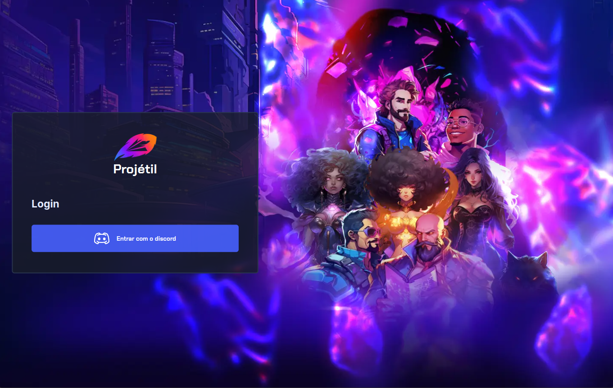
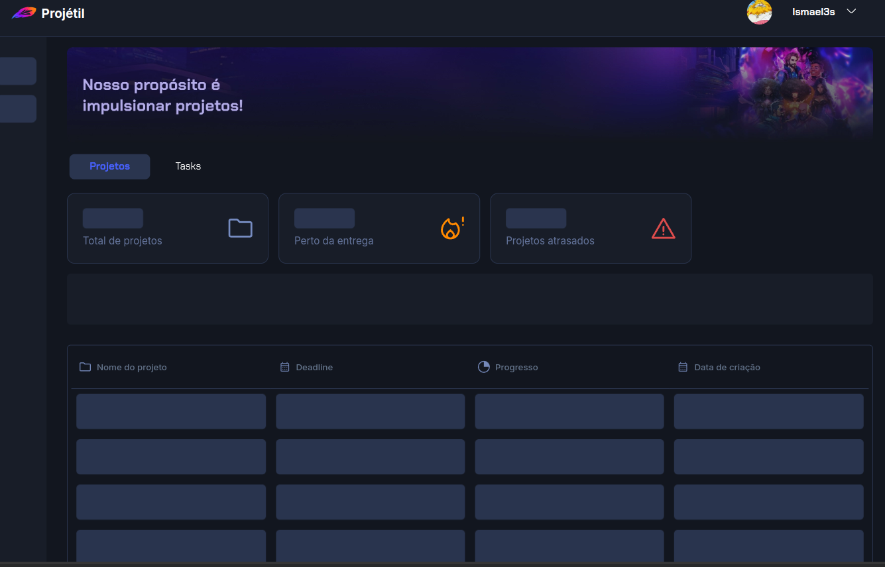

SGD is a white-label product used by two software houses focused on solving companies' problems with task management, budget spending by project, and providing metrics about the company.

## Why was this product created?

There are many tools in the market that can handle the core functionalities of SGD, but this product stands out by addressing specific company needs, such as metrics on how money was spent on freelancers for every team (Design, Product, Developers, Infra). The freelancers of the company are also users of the platform, where they can see their income for every task they completed and integrate with Discord.

## What did I do in this project?

In this project, I did everything from scratch except for the design, which was created by the team at [Astriu](https://linkedin.com/company/astriu). Because of this, I had to understand the needs of the company and discuss how the problems could be solved, from planning to implementing both the frontend and backend.

## What are the results?

As a result, these companies are using SGD to manage their freelancers' teams:

- <a href="https://www.linkedin.com/company/proje-til/" target="_blank">Projétil</a>
- <a href="https://www.linkedin.com/company/undefinedit/" target="_blank">Undefined Technology</a>

This has improved the management of their operations by focusing everything that they needs in one application.

### Is this project finished?

No, the project is still receiving updates, but the product is already in use.

### What technologies were used in the frontend of this project?

The frontend uses: Git, ReactJS, React Hooks, NextJS, TypeScript, Node, React Query, NextAuth, React DND, Jest, Tailwind, Shadcn, and Axios.

### What technologies were used in the backend of this project?

The backend uses: Git, C#, .NET, Entity Framework, PostgreSQL, TestContainers, xUnit, Unit and Integration Tests, Docker, HangFire, Vertical Slice, Multi-Tenant.

### How is this project deployed?

Both the frontend and backend are deployed using CI/CD with Azure DevOps Pipelines. The frontend is deployed to Vercel, and the backend is deployed using Docker to Railway (although we have tried other cost-effective cloud options such as Render).

### What were the challenges in this project?

For me, one of the main challenges was how the data is stored for each tenant. At the moment, each company has its own database, and only one frontend is deployed for both companies. Based on the hostname, we decide which database the application will query for data. Given the size of the application, this solution is "good enough" but can be improved as the product grows.
